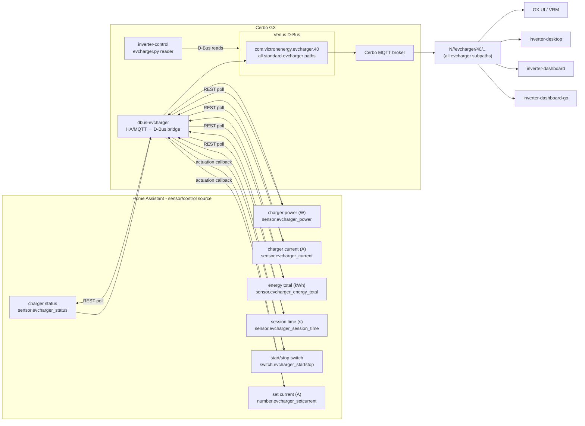

# dbus-evcharger

Home-Assistant-backed EV charger bridge for Victron Venus OS.

Runs **on the Cerbo GX** and exposes an EV charger as a native Venus service:

- `com.victronenergy.evcharger.<N>` (`DEVICE_INSTANCE`) — EV charger with all standard metrics:
  - `/Status` (0 disconnected, 1 connected, 2 charging, 3 charged, 4 waiting for sun...)
  - `/Ac/Power` (W)
  - `/Ac/Energy/Forward` (kWh total)
  - `/Ac/L1/Power` (W)
  - `/Ac/L1/Voltage` (V)
  - `/Ac/L1/Current` (A)
  - `/Current` (A actual)
  - `/SetCurrent` (A setpoint)
  - `/Mode` (0 Manual, 1 Auto, 2 Scheduled)
  - `/StartStop` (0 Stop, 1 Start)
  - `/Position` (0 AC Output, 1 AC Input)
  - `/MinCurrent` / `/MaxCurrent` (A limits)
  - `/Session/Time` (seconds)
  - `/Session/Energy` (kWh)

Venus OS bridges this service to Cerbo MQTT topics
`N/<portal>/evcharger/<instance>/...`,
which is what the remote consumers (desktop, dashboards) subscribe to.

The bridge can source metrics from Home Assistant (REST API) or MQTT (optional fallback),
and writes control commands (mode, start/stop, set current) back to the same sources.

### EV charger data flow

dbus-evcharger is the **only** EV charger source for every consumer: Venus services on
D-Bus locally, Cerbo MQTT topics remotely. No client talks to Home Assistant
or MQTT for EV charger data.



Consumers and the paths they read:

| Consumer | Source | Path/topic |
| --- | --- | --- |
| GX UI / VRM | D-Bus | native EV charger device |
| inverter-control (on GX) | D-Bus | `com.victronenergy.evcharger.40` (all standard paths) |
| inverter-desktop | Cerbo MQTT | `N/<portal>/evcharger/40/...` |
| inverter-dashboard | Cerbo MQTT | same, gated by `CERBO_PORTAL_ID` |
| inverter-dashboard-go | Cerbo MQTT | same, `cerbo:` config section |

## Configuration

Copy `local_config.example.py` to `local_config.py` on the device and fill in:

| Key | Meaning | Default |
| --- | --- | --- |
| `HA_URL` / `HA_TOKEN` | Home Assistant REST endpoint + long-lived token | — |
| `HA_STATUS_ENTITY` | EV charger status sensor | `sensor.evcharger_status` |
| `HA_POWER_ENTITY` | charger power sensor (W) | `sensor.evcharger_power` |
| `HA_CURRENT_ENTITY` | charger current sensor (A) | `sensor.evcharger_current` |
| `HA_ENERGY_ENTITY` | energy total sensor (kWh) | `sensor.evcharger_energy_total` |
| `HA_SESSION_TIME_ENTITY` | session time sensor (s) | `sensor.evcharger_session_time` |
| `HA_STARTSTOP_ENTITY` | start/stop switch entity | `switch.evcharger_startstop` |
| `HA_SETCURRENT_ENTITY` | set current number entity | `number.evcharger_setcurrent` |
| `MQTT_ENABLED` | enable MQTT fallback | False |
| `MQTT_HOST` / `MQTT_PORT` / `MQTT_USERNAME` / `MQTT_PASSWORD` | MQTT broker connection | localhost:1883 |
| `MQTT_TOPIC` | base topic for EV charger | `evcharger` |
| `MQTT_QOS` | MQTT quality of service | 1 |
| `DEVICE_INSTANCE` | D-Bus device instance for the evcharger service | 40 |
| `PRODUCT_NAME` | D-Bus product name (auto-read from version) | dbus-evcharger |
| `DEFAULT_POSITION` | default position (0=AC Output, 1=AC Input) | 0 |
| `DEFAULT_MAX_CURRENT` | default max current limit (A) | 32.0 |
| `DEFAULT_MIN_CURRENT` | default min current limit (A) | 6.0 |
| `DEFAULT_NR_OF_PHASES` | default number of phases | 1 |
| `DEFAULT_CUSTOM_NAME` | default custom name for the charger | "EV Charger" |
| `POLL_INTERVAL` | seconds between HA polls | 15.0 |
| `HA_TIMEOUT` | seconds before HA request times out | 3.0 |

### Control flow

- **HA primary**: A single background worker polls HA and grid voltage at the configured `POLL_INTERVAL`. Requests are coalesced while a job or its main-loop delivery is pending; slow HTTP/D-Bus reads cannot block the GLib loop. Results publish immediately when delivered on that loop.
- **MQTT fallback**: If HA has no usable status and power, the main loop reads the optional nonblocking MQTT cache at least once per second, independently of the slower HA request schedule. One paho loop owns connection attempts and reconnects. Status and power must each have arrived within five seconds; other topics, broker connection and reconnect cannot renew them. Optional fields expire independently.
- **Freshness**: The main loop admits a worker result only within `max(3 * HA_TIMEOUT, 2 * POLL_INTERVAL)` seconds of collection start. MQTT fields retain their original five-second expiry. Expiry is checked at most one second apart under normal event-loop scheduling; these are not hard real-time guarantees. Failed, expired or non-finite required values clear `/Connected` and measurement paths. Fresh usable readings restore them. Cached grid voltages are reused only within the same acquisition-age limit.
- **Measurements**: Missing optional values stay invalid rather than becoming zero. Each phase's current uses its own measured or estimated power and voltage. Balanced power estimates use `DEFAULT_NR_OF_PHASES`; explicit zero power and measured currents are retained.
- **Control mirroring**: Configured HA/MQTT start/stop and current values are mirrored into the D-Bus control paths. The current service callbacks do not send D-Bus writes back to HA or MQTT; this release does not add physical charger actuation.

## Install


Via SetupHelper PackageManager (GUI v1): drop the repo in `/data/dbus-evcharger`
(must contain `version` + `setup`). Then Settings → PackageManager → install,
or:

```sh
/data/dbus-evcharger/setup install
/data/dbus-evcharger/setup uninstall
```

`gitHubInfo` is `victron-venus:latest`. Device-local `local_config.py` is not overwritten.


```sh
./deploy.sh          # streams repo to Cerbo, runs update.sh there
./restart.sh         # restart the service only
ssh cerbo 'tail -f /var/log/dbus-evcharger/current'   # logs
```

Uninstall:

```sh
ssh cerbo 'svc -dk /service/dbus-evcharger/log /service/dbus-evcharger; rm /service/dbus-evcharger'
```

## Safety model

- **Connection monitoring**: `/Connected` means usable, unexpired charger status and power; a connected broker alone is insufficient.
- **Control paths**: `/Mode`, `/StartStop` and `/SetCurrent` are exposed on D-Bus. Accepted local path writes do not prove a charger command was sent or accepted by hardware.
- **Numeric values**: Measurements are finite numeric values or invalid D-Bus values. Unknown source states and unavailable power do not become connected zero-power readings.
- **Graceful shutdown**: SIGTERM stops poll submission and suppresses queued or late callbacks. The worker closes clients after its active bounded read finishes; shutdown waits up to one second and the worker is a daemon thread. An in-flight network read cannot be retracted.
- **Off-GX testing**: Service uses `NullDbusService` when venibus Python packages unavailable
  (development/testing on laptop).

## Development

```sh
python3 -m venv .venv && source .venv/bin/activate
uv sync --locked --extra dev
python3 -m pytest tests/
python3 -m ruff check .
```

Tests run fully off-GX (D-Bus and HA/MQTT are mocked).
Worker tests cover blocked reads, main-loop delivery, late results and shutdown;
MQTT tests cover independent expiry, reconnect and invalid payloads. These tests
do not verify physical charging, actual broker outages or power-cycle startup.

## License

MIT — see [LICENSE](LICENSE).


## Venus OS installation and recovery

Use the canonical `/data/dbus-evcharger` directory. Both `setup install`
(SetupHelper/PackageManager) and the workstation `deploy.sh` call `update.sh`.
A release is staged under volatile `/tmp` before stopping the service, so
reinstalling from the installed tree does not delete the update source.
The updater preserves `local_config.py`; `deploy.sh` deliberately replaces it
when the workstation has a local copy (`PUSH_LOCAL_CONFIG=1`).
Existing service and log directory inodes, ownership, supervisor state and the
canonical `/service` symlink are preserved. Only the application is stopped;
run scripts are replaced atomically and a healthy logger keeps running.
Ordinary updates do not restart PackageManager. A stuck application receives
one supervisor-scoped kill after twenty seconds; installation aborts if it is
still running after twenty-five seconds. Unexpected service links, real `/service`
directories or legacy firmware copies require a separate migration before
updating; the updater leaves them untouched.

Service definitions persist under `/data/dbus-evcharger/service/dbus-evcharger`.
`/service/dbus-evcharger` is a symlink recreated by `/data/rc.local`, including
when that script already ends with `exit 0`. The logger creates
`/var/log/dbus-evcharger` and uses bounded `multilog` rotation (`s25000 n4`).
On the audited Venus OS image, `/var/log` resolves to persistent `/data/log`,
so these logs write flash. Heartbeats live in volatile `/run` storage.
Runtime data does not require writes to the
read-only firmware filesystem. Firmware updates can replace system Python
packages; check dependencies after each update before assuming the service is
healthy. The installer does not run `pip` or upgrade system packages.

Before installation, check the target interpreter:

```sh
python3 --version
python3 -c "import requests, dbus, paho.mqtt.client; from gi.repository import GLib"
```

Verify a running process and its D-Bus data after installation:

```sh
svstat /service/dbus-evcharger /service/dbus-evcharger/log
readlink /service/dbus-evcharger
tail -n 40 /var/log/dbus-evcharger/current
```

`update.sh` confirms termination before copying but does not wait for a fresh
process or heartbeat after requesting startup. The deployment caller must
verify startup and D-Bus availability.

`deploy.sh` fails if a fresh heartbeat does not appear within 60 seconds or the
service never reaches `up`. A heartbeat proves the loop is running, not that
Home Assistant is reachable: also inspect `/Connected` and the log. Restore a
previous release with its `update.sh`, keeping the device-local configuration.
Installer regressions cover repeated updates with live directory handles,
supervisor-state and ownership preservation, atomic run-script replacement,
configuration, safe rejection before stopping, and boot hooks before `exit 0`.

### Native D-Bus startup

The service constructs `VeDbusService` with `register=False`, creates all paths,
applies configured initial values, and then registers each well-known name once.
The production bridge starts with `/Connected = 0` until it has a valid source
snapshot. A failure during initialization does not expose a partial service.
This uses the Venus OS registration lifecycle; it does not change local control
settings, source freshness deadlines, or the installer layout.
