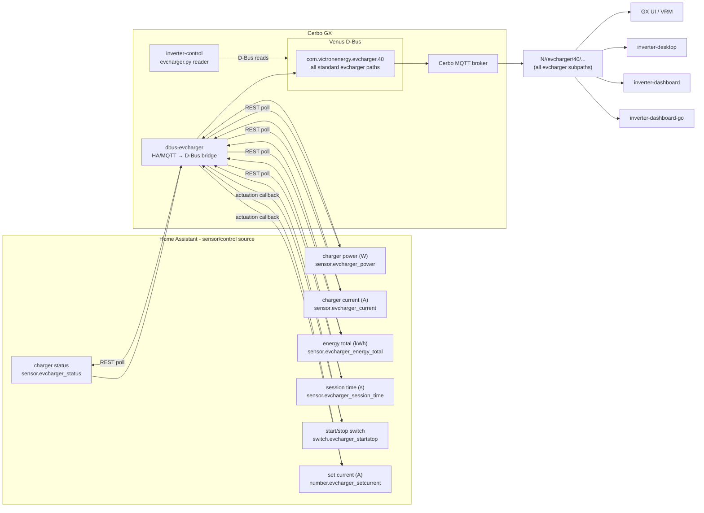

# dbus-evcharger

Home-Assistant-backed EV charger bridge for Victron Venus OS.

Runs **on the Cerbo GX** and exposes an EV charger as a native Venus service:

- `com.victronenergy.evcharger.<N>` (`DEVICE_INSTANCE`) — EV charger with all standard metrics:
  - `/Status` (0 disconnected, 1 connected, 2 charging, 3 charged, 4 waiting for sun...)
  - `/Ac/Power` (W)
  - `/Ac/Energy/Forward` (kWh total)
  - `/Ac/L1/Power` (W)
  - `/Ac/L1/Voltage` (V)
  - `/Ac/L1/Current` (A)
  - `/Current` (A actual)
  - `/SetCurrent` (A setpoint)
  - `/Mode` (0 Manual, 1 Auto, 2 Scheduled)
  - `/StartStop` (0 Stop, 1 Start)
  - `/Position` (0 AC Output, 1 AC Input)
  - `/MinCurrent` / `/MaxCurrent` (A limits)
  - `/Session/Time` (seconds)
  - `/Session/Energy` (kWh)

Venus OS bridges this service to Cerbo MQTT topics
`N/<portal>/evcharger/<instance>/...`,
which is what the remote consumers (desktop, dashboards) subscribe to.

The bridge can source metrics from Home Assistant (REST API) or MQTT (optional fallback),
and writes control commands (mode, start/stop, set current) back to the same sources.

### EV charger data flow

dbus-evcharger is the **only** EV charger source for every consumer: Venus services on
D-Bus locally, Cerbo MQTT topics remotely. No client talks to Home Assistant
or MQTT for EV charger data.



Consumers and the paths they read:

| Consumer | Source | Path/topic |
| --- | --- | --- |
| GX UI / VRM | D-Bus | native EV charger device |
| inverter-control (on GX) | D-Bus | `com.victronenergy.evcharger.40` (all standard paths) |
| inverter-desktop | Cerbo MQTT | `N/<portal>/evcharger/40/...` |
| inverter-dashboard | Cerbo MQTT | same, gated by `CERBO_PORTAL_ID` |
| inverter-dashboard-go | Cerbo MQTT | same, `cerbo:` config section |

## Configuration

Copy `local_config.example.py` to `local_config.py` on the device and fill in:

| Key | Meaning | Default |
| --- | --- | --- |
| `HA_URL` / `HA_TOKEN` | Home Assistant REST endpoint + long-lived token | — |
| `HA_STATUS_ENTITY` | EV charger status sensor | `sensor.evcharger_status` |
| `HA_POWER_ENTITY` | charger power sensor (W) | `sensor.evcharger_power` |
| `HA_CURRENT_ENTITY` | charger current sensor (A) | `sensor.evcharger_current` |
| `HA_ENERGY_ENTITY` | energy total sensor (kWh) | `sensor.evcharger_energy_total` |
| `HA_SESSION_TIME_ENTITY` | session time sensor (s) | `sensor.evcharger_session_time` |
| `HA_STARTSTOP_ENTITY` | start/stop switch entity | `switch.evcharger_startstop` |
| `HA_SETCURRENT_ENTITY` | set current number entity | `number.evcharger_setcurrent` |
| `MQTT_ENABLED` | enable MQTT fallback | False |
| `MQTT_HOST` / `MQTT_PORT` / `MQTT_USERNAME` / `MQTT_PASSWORD` | MQTT broker connection | localhost:1883 |
| `MQTT_TOPIC` | base topic for EV charger | `evcharger` |
| `MQTT_QOS` | MQTT quality of service | 1 |
| `DEVICE_INSTANCE` | D-Bus device instance for the evcharger service | 40 |
| `PRODUCT_NAME` | D-Bus product name (auto-read from version) | dbus-evcharger |
| `DEFAULT_POSITION` | default position (0=AC Output, 1=AC Input) | 0 |
| `DEFAULT_MAX_CURRENT` | default max current limit (A) | 32.0 |
| `DEFAULT_MIN_CURRENT` | default min current limit (A) | 6.0 |
| `DEFAULT_NR_OF_PHASES` | default number of phases | 1 |
| `DEFAULT_CUSTOM_NAME` | default custom name for the charger | "EV Charger" |
| `POLL_INTERVAL` | seconds between HA polls | 15.0 |
| `HA_TIMEOUT` | seconds before HA request times out | 3.0 |

### Control flow

- **HA primary**: Service polls HA REST API for all sensor values every POLL_INTERVAL seconds.
- **MQTT fallback**: If HA is unavailable and MQTT is enabled, falls back to last MQTT message.
- **Stale data**: If both sources fail, last known values are retained until connection restored.
- **Write path**: Changes to `/Mode`, `/StartStop`, or `/SetCurrent` in Venus OS/VRM are written
  back to HA (switch/number entities) or MQTT (command topics) if configured.

## Install


Via SetupHelper PackageManager (GUI v1): drop the repo in `/data/dbus-evcharger`
(must contain `version` + `setup`). Then Settings → PackageManager → install,
or:

```sh
/data/dbus-evcharger/setup install
/data/dbus-evcharger/setup uninstall
```

`gitHubInfo` is `victron-venus:latest`. Device-local `local_config.py` is not overwritten.


```sh
./deploy.sh          # streams repo to Cerbo, runs update.sh there
./restart.sh         # restart the service only
ssh cerbo 'tail -f /var/log/dbus-evcharger/current'   # logs
```

Uninstall:

```sh
ssh cerbo 'svc -dk /service/dbus-evcharger/log /service/dbus-evcharger; rm /service/dbus-evcharger'
```

## Safety model

- **Connection monitoring**: `/Connected` on D-Bus service reflects HA/MQTT connectivity.
- **Manual override**: `/Mode`, `/StartStop`, `/SetCurrent` on D-Bus service accept writes from VRM/GUI
  and forward them to HA/MQTT.
- **Numeric values**: All metrics are numeric (int/float) as per VE.Dbus specification — no strings.
- **Graceful shutdown**: SIGTERM stops the update loop and exits cleanly.
- **Off-GX testing**: Service uses `NullDbusService` when venibus Python packages unavailable
  (development/testing on laptop).

## Development

```sh
python3 -m venv .venv && source .venv/bin/activate
pip install -e ".[dev]"
python3 -m pytest tests/
python3 -m ruff check .
```

Tests run fully off-GX (D-Bus and HA/MQTT are mocked).

## License

MIT — see [LICENSE](LICENSE).
